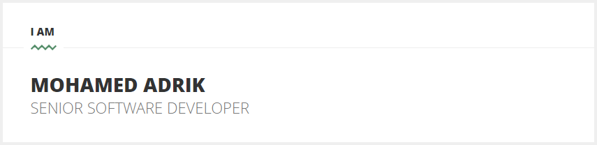

## Hi! 👋

A passionate software developer with a keen interest in building scalable and efficient applications. I enjoy working on backend technologies and am always eager to learn new things.

- 🌱 I’m currently learning IntelliJ Platform SDK.
- 👯 I’m looking to collaborate on IntelliJ Platform related project(s).
- 💬 Ask me about IntelliJ plugin development.
- 📫 How to reach me: <kbd>www.mohamedadrik.com</kbd> > <kbd>CONTACT</kbd> > <kbd>SEND ME AN EMAIL</kbd>.
- ⚡ Fun fact: I originate from Morocco, and can speak 5️⃣ languages.

Here are some technologies and tools I work with:

- **Languages**: Java and Kotlin
- **Frameworks**: Spring Framework, Spring Boot, Spring Security, Spring batch
- **Tools**: Git, Docker, Intellij
- **Databases**: Oracle, MySql and Microsoft Sql Server

Thank you for visiting my profile!

